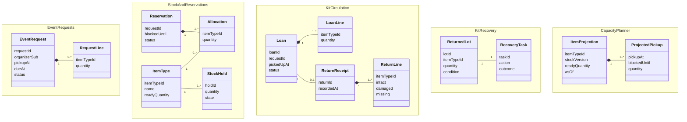

# EcoShift domain classes

These are separate service data models. Cross-service IDs are references carried in contracts. They are not database foreign keys.

```mermaid
classDiagram
    namespace EventRequests {
        class EventRequest {
            requestId
            organizerSub
            pickupAt
            dueAt
            status
        }
        class RequestLine {
            itemTypeId
            quantity
        }
    }
    EventRequest "1" *-- "1..*" RequestLine
    namespace StockAndReservations {
        class Reservation {
            requestId
            blockedUntil
            status
        }
        class Allocation {
            itemTypeId
            quantity
        }
        class ItemType {
            itemTypeId
            name
            readyQuantity
        }
        class StockHold {
            holdId
            quantity
            state
        }
    }
    Reservation "1" *-- "1..*" Allocation
    ItemType "1" -- "0..*" Allocation
    ItemType "1" -- "0..*" StockHold
    namespace KitCirculation {
        class Loan {
            loanId
            requestId
            pickedUpAt
            status
        }
        class LoanLine {
            itemTypeId
            quantity
        }
        class ReturnReceipt {
            returnId
            recordedAt
        }
        class ReturnLine {
            itemTypeId
            intact
            damaged
            missing
        }
    }
    Loan "1" *-- "1..*" LoanLine
    Loan "1" -- "0..1" ReturnReceipt
    ReturnReceipt "1" *-- "1..*" ReturnLine
    namespace KitRecovery {
        class ReturnedLot {
            lotId
            itemTypeId
            quantity
            condition
        }
        class RecoveryTask {
            taskId
            action
            outcome
        }
    }
    ReturnedLot "1" -- "1" RecoveryTask
    namespace CapacityPlanner {
        class ItemProjection {
            itemTypeId
            stockVersion
            readyQuantity
            asOf
        }
        class ProjectedPickup {
            pickupAt
            blockedUntil
            quantity
        }
    }
    ItemProjection "1" *-- "0..*" ProjectedPickup
```
